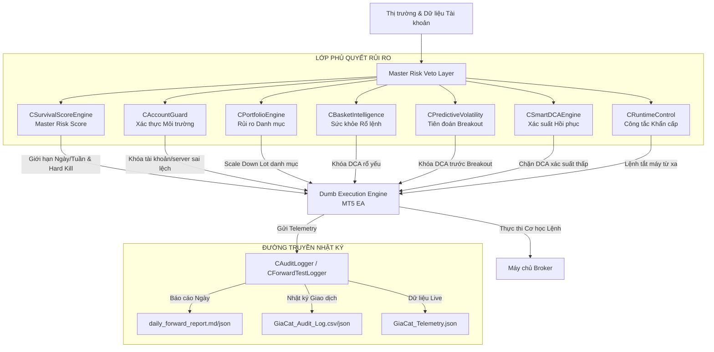

# Tài Liệu Thiết Kế Kiến Trúc (Architecture Specification) — Gia Cat Quant

Tài liệu này đặc tả kiến trúc phân lớp của hệ thống giao dịch **Gia Cat Quant Survival Engine (Phiên bản V3)**. Hệ thống được tách biệt hoàn toàn giữa **Lớp Thực Thi Cơ Bản (Dumb Execution Engine)** và **Lớp Phủ Quyết Rủi Ro (Master Risk Veto Layer)** theo triết lý thiết kế phần mềm phòng vệ định lượng của các tổ chức tài chính.

---

## 🗺️ 1. Sơ Đồ Kiến Trúc Hệ Thống (System Architecture Diagram)

Dưới đây là mô hình luồng dữ liệu và cơ chế kiểm soát rủi ro từ thị trường đến quá trình vào lệnh thực tế:

---

## 🏛️ 2. Các Lớp Kiến Trúc Cốt Lõi (Core Layers)

Kiến trúc hệ thống được chia làm 3 lớp độc lập:

### 1. Lớp Thu Thập Dữ Liệu & Phân Tích (Analysis Layer)
Chịu trách nhiệm quét dữ liệu thị trường và phân loại môi trường giao dịch:
* **`CRegimeEngine`**: Đọc ADX H1, ATR H1 để phân loại thị trường thành `TRENDING`, `RANGING`, hoặc `TRANSITION`.
* **`CVolatilityEngine`**: Đọc ATR M15 để tính toán khoảng cách đặt lưới động cho lệnh DCA tiếp theo.
* **`CSessionGovernor`**: Quản lý các khung giờ giao dịch theo phiên GMT và quét lịch tin kinh tế để thiết lập vùng blackout cấm giao dịch.

### 2. Lớp Phủ Quyết Rủi Ro Tối Cao (Master Risk Veto Layer)
Đóng vai trò là chốt kiểm duyệt cuối cùng trước khi lệnh được phép chuyển tới sàn. Mọi quyết định mở lệnh hay DCA đều phải được thông qua sự đồng thuận (Consensus) của các bộ máy con:
* **`CAccountGuard`**: Xác thực số tài khoản, tên máy chủ, mức đòn bẩy và kiểm tra mức ký quỹ an toàn theo 4 ngưỡng.
* **`CPortfolioEngine`**: Giám sát tổng khối lượng vị thế (lot cap), nồng độ rủi ro đồng USD và tương quan nghịch các tài sản để tự động giảm volume.
* **`CBasketIntelligence`**: Quét tuổi thọ, adverse excursion và khoảng cách BE của rổ lệnh hiện tại để phân cấp sức khỏe.
* **`CPredictiveVolatility`**: Tiên đoán sớm breakout bằng cách đo độ nén Bollinger Band Width M15 trước tin bão.
* **`CSmartDCAEngine`**: Phân tích xác suất hồi phục dựa trên điểm số có trọng số và áp dụng thuật toán giảm dần Martingale (Martingale Decay).
* **`CSurvivalScoreEngine`**: Bộ não trung tâm tính toán điểm sinh tồn dựa trên vốn đầu tuần (**Weekly Starting Equity**), đóng sạch lệnh khi chạm sụt giảm tuần (8%).
* **`CRuntimeControl`**: Công tắc kìm cương khẩn cấp (Kill Switch) kết nối từ xa.

### 3. Lớp Thực Thi Cơ Học (Dumb Execution Engine)
Mã nguồn chính của EA MT5 đóng vai trò là Lớp Thực Thi Cơ Học. Lớp này được thiết kế **"Dumb" (Không có trí thông minh tự quyết)**:
* Chỉ làm nhiệm vụ gửi lệnh mua/bán, sửa SL/TP và theo dõi lệnh theo Magic Number.
* Trước khi gửi lệnh, lớp này bắt buộc phải gọi các hàm kiểm duyệt rủi ro của **Master Risk Veto Layer**. Nếu bất kỳ bộ máy rủi ro nào trả về kết quả cấm (`Veto = true`), lớp thực thi bắt buộc phải hủy lệnh ngay lập tức.

---

## 📈 3. Luồng Telemetry & Giám Sát Vận Hành (Telemetry Data Flow)

Hệ thống telemetry được tổ chức chặt chẽ để đảm bảo an toàn thông tin:
1. **Mã hóa ẩn thông tin (Masking)**: Số tài khoản MT5 và token Telegram được mã hóa trước khi ghi vào file hoặc hiển thị trên log. Mật khẩu tài khoản không bao giờ được ghi chép.
2. **Ghi nhật ký song song (Dual Logging)**:
   * **Định dạng CSV**: Dành cho phân tích bảng tính, Import vào Excel/Python Pandas để chạy hồi quy.
   * **Định dạng JSON Lines**: Dành cho tích hợp hệ thống Web Dashboard hiển thị biểu đồ thời gian thực.
3. **Daily Telemetry**: Cứ sau mỗi 24 giờ, hệ thống tự động tổng hợp tỷ lệ chạy máy liên tục (Uptime), số lần gián đoạn kết nối Broker và xuất báo cáo giám sát dạng Markdown thân thiện.
