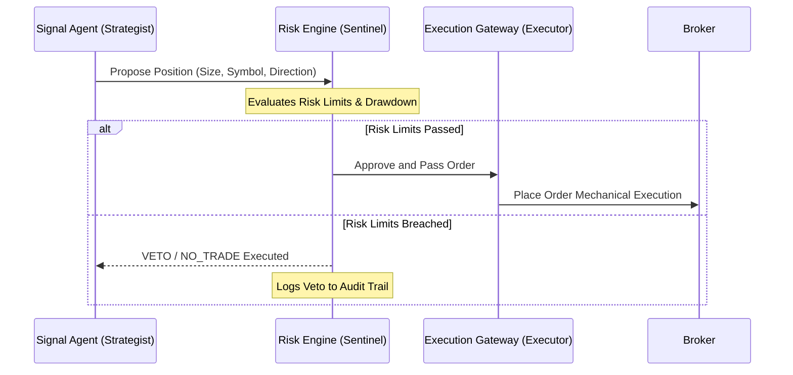

# MULTI-AGENT SPECIFICATION & COLLABORATION PROTOCOL (AGENTS.md)
> Target Version: Quant V9 Survival Engine
> Authority: Advisory Only (Risk Engine Veto Sovereign)

This document establishes the roles, communication interfaces, and sovereignty rules for all AI agents acting in this workspace.

---

## 👥 1. AGENT ROLES

### 🧠 1. The Strategist (Signal Agent)
- **Role:** Analyzes market data (ADX, ATR, Price) to formulate raw trade signals.
- **Constraints:** ADVISORY ONLY. Has zero execution authority. Cannot write or submit trades directly to the execution gateway without passing through the Risk Layer.

### 🛡️ 2. The Sentinel (Risk Engine / Portfolio Guard)
- **Role:** Sovereignty Gatekeeper. Holds absolute Veto authority over all Signal Agent proposals.
- **Constraints:** MUST evaluate every position against the Risk Constitution. If a risk limit (Drawdown, Margin, Lot Concentration) is breached, it executes a VETO.

### ⚙️ 3. The Executor (Dumb Execution Gateway)
- **Role:** Pure mechanical order placement and SL/TP management.
- **Constraints:** Dumb execution only. No signals. No strategy logic. It only translates approved Sentinel actions into broker commands.

---

## 🤝 2. COLLABORATION PROTOCOL

