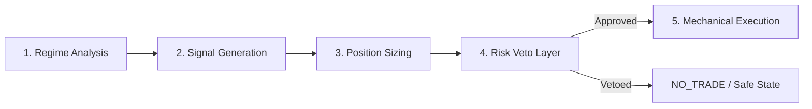

# CORE QUANT PIPELINE SPECIFICATION (MASTER_SPEC.md)
> Mode: Deterministic Verification

This document specifies the unidirectional data flow and strict coupling rules for the core trading pipeline of the NowTrading Quant V9 system.

---

## 🗺️ 1. THE FIVE-STAGE QUANT PIPELINE

### 📈 Stage 1: Regime Analysis (CRegimeEngine)
- **Role:** Classifies market context into `TRENDING`, `RANGING`, or `TRANSITION`.
- **Inputs:** ADX H1, ATR H1, RSI H1.
- **Output:** `ENUM_MARKET_REGIME` state.

### 🎯 Stage 2: Signal Generation (Strategist)
- **Role:** Generates entry direction (Buy/Sell) based on the classified regime.
- **Ranging:** Mean-reversion signals.
- **Trending:** Breakout/momentum alignment.

### 📊 Stage 3: Position Sizing (CPortfolioEngine)
- **Role:** Calculates raw lot exposure.
- **Inputs:** Current account equity, regime lot scale multiplier, correlation constraints.

### 🛡️ Stage 4: Risk Veto Layer (CSurvivalScoreEngine / CAccountGuard)
- **Role:** Ultimate verification gate. Calculates Survival Score (0-100).
- **Veto Rules:**
  - If Weekly Drawdown >= 5.0% -> `SAFE_MODE` (lot size reduced 60%, spacing doubled).
  - If Weekly Drawdown >= 8.0% -> `HARD_KILL` (close all positions immediately, uninstall EA).
  - If Margin Level <= 300% -> `SOFT_BLOCK` (disable new DCA orders).

### ⚙️ Stage 5: Mechanical Execution (Dumb Execution Gateway)
- **Role:** Transmits order requests to the brokerage. Has no decision-making capabilities.

---

## 🔒 PROTECTED COMPONENTS (HUMAN_APPROVAL REQUIRED)
The following components are marked **read-only** to AI agents:
1. **`risk_engine`** (`CSurvivalScoreEngine`, `CEquityDefense`)
2. **`execution_gateway`** (`Dumb Execution Gateway`)
3. **`risk_limits`** (`CAccountGuard`)
4. **`portfolio_guard`** (`CPortfolioEngine`)
